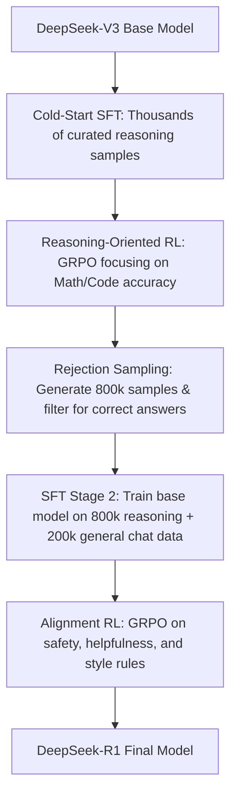

# Hugging Face Model Card: DeepSeek-R1

This report provides a detailed breakdown of **DeepSeek-R1**, one of the most significant and trending open-weights reasoning models on Hugging Face. It competes directly with proprietary frontier reasoning models (such as OpenAI's o1/o3 series) using innovative training paradigms, cost-efficient architectures, and large-scale distillation.

---

## 1. Model Overview

*   **Developer:** DeepSeek
*   **Release Date:** January 2025
*   **Model Type:** Autoregressive Mixture-of-Experts (MoE) Language Model
*   **Parameters:** 671B total parameters (37B active parameters per token)
*   **Context Window:** 128k tokens
*   **Key Capabilities:** Complex math reasoning, advanced programming (code generation and debugging), logical inference, and multi-turn conversations.
*   **Primary Hub Link:** [huggingface.co/deepseek-ai/DeepSeek-R1](https://huggingface.co/deepseek-ai/DeepSeek-R1)

---

## 2. Dataset and Data Collection Process

DeepSeek-R1's dataset creation was a multi-stage pipeline designed to transition the model from pure reinforcement-learning behavior to a highly readable, helpful, and safe chat assistant.

### A. Cold-Start Dataset (SFT Stage 1)
To prevent the model from starting reinforcement learning from a completely raw state (which causes severe language mixing and poor formatting), DeepSeek collected **several thousand high-quality reasoning samples**.
*   **Source:** Human annotators, curated synthetic data, and self-correction outputs.
*   **Format:** System prompts instructing the model to provide a detailed, step-by-step thinking process wrapped in `<think>...</think>` tags, followed by the final answer.

### B. Reasoning Rejection Sampling Dataset (SFT Stage 2)
After training an intermediate RL model, DeepSeek generated **800,000 reasoning samples** across coding, math, science, and logic.
*   **Filtering (Rejection Sampling):** Out of the 800,000 generated sequences, only outputs with correct final answers (verified using compiler test cases for code or rule checkers for math) and logical reasoning paths were kept.
*   **Purpose:** To teach the model structured reasoning without requiring expensive manual human annotations for every step.

### C. Non-Reasoning SFT Dataset
To maintain the model's capabilities in general chat, translation, creative writing, and safety alignment, DeepSeek blended the reasoning data with:
*   **Size:** Approximately **200,000 samples**.
*   **Content:** Helpful and harmless instruction tuning data.

### D. Distillation Dataset
DeepSeek used the 800k high-quality reasoning samples to directly fine-tune standard open-weights architectures (such as Qwen and Llama), creating highly popular distilled versions.

---

## 3. Training Parameters & Stages

DeepSeek-R1 was trained using a combination of Supervised Fine-Tuning (SFT) and Group Relative Policy Optimization (GRPO), an efficient reinforcement learning algorithm.

### Stage 1: Cold-Start Supervised Fine-Tuning
*   **Goal:** Establish basic readability and format alignment.
*   **Training parameters:** Low learning rate, small batch size, focused on learning sequence structures.

### Stage 2: Reasoning-Oriented RL (GRPO)
Instead of standard PPO (which requires a memory-heavy critic model), DeepSeek used **Group Relative Policy Optimization (GRPO)**.
*   **GRPO Mechanism:** For a single prompt, the model generates a group of outputs ($q_1, q_2, \dots, q_G$). The reward for each output is normalized against the average of the group, eliminating the need for a separate critic neural network.
*   **Reward Function:**
    *   *Accuracy Rewards:* Deterministic rule checkers (e.g., did the math answer match the ground truth? Did the code execute and pass tests?).
    *   *Format Rewards:* Positive reinforcement for using `<think>` and `</think>` tags correctly.

### Stage 3: SFT Stage 2 (Rejection Sampling Fine-Tuning)
The base DeepSeek-V3 model was fine-tuned on the combined 800k reasoning and 200k general chat samples. This stage stabilized the model and significantly improved its language consistency.

### Stage 4: RL for Alignment (Safety and Style)
A final round of GRPO was conducted using:
*   **Helpfulness & Harmlessness Rewards:** Based on safety classifiers and human preferences.
*   **Thinking Length Adjustments:** Slight penalty for excessive verbosity in non-reasoning contexts to prevent the model from thinking before simple greetings.

---

## 4. Architecture Details

DeepSeek-R1 is built on the **DeepSeek-V3** core architecture, which incorporates two major innovations:

### A. MLA (Multi-head Latent Attention)
Standard Multi-Query Attention (MQA) and Grouped-Query Attention (GQA) reduce KV cache size but hurt representation capacity. MLA solves this by compressing the Key and Value matrices into a low-dimensional latent space:
*   **Mechanism:** It projects Key-Value vectors into a small latent vector (e.g., 512 dimensions) during training and decompresses them dynamically.
*   **Benefit:** Reduces KV Cache usage by up to **93%**, allowing the model to handle larger batch sizes and 128k context lengths on standard hardware.

### B. DeepSeekMoE (Mixture-of-Experts)
DeepSeek-R1 does not activate all 671B parameters per token.
*   **Shared Experts:** A set of routing-independent experts that process every token to capture common knowledge.
*   **Routed Experts:** Dynamic routing selects the top-$N$ experts for specific token specializations.
*   **Configuration:** Out of 671B total parameters, only **37B are active** per token. This keeps computation costs low (similar to running a 37B dense model) while preserving the representation power of a 671B parameter system.

---

## 5. Distillation Family (The Hugging Face Phenom)

A major reason DeepSeek-R1 dominated Hugging Face trending lists is the release of **distilled models**. DeepSeek bypassed RL training for smaller models, choosing instead to train them directly on DeepSeek-R1's 800,000 reasoning SFT samples.

| Distilled Model Name | Base Architecture | Total Parameters | Hugging Face Hub Impact |
| :--- | :--- | :--- | :--- |
| **DeepSeek-R1-Distill-Qwen-1.5B** | Qwen-2.5-1.5B | 1.5 Billion | Runs locally on mobile phones / edge devices. |
| **DeepSeek-R1-Distill-Qwen-8B** | Qwen-2.5-8B | 8 Billion | Competes with Llama-3-70B on math and coding benchmarks. |
| **DeepSeek-R1-Distill-Qwen-14B** | Qwen-2.5-14B | 14 Billion | Highly popular for local developer setups. |
| **DeepSeek-R1-Distill-Qwen-32B** | Qwen-2.5-32B | 32 Billion | Flagship local reasoning performance. |
| **DeepSeek-R1-Distill-Llama-8B** | Llama-3.1-8B | 8 Billion | Popular alternative for Llama-based pipelines. |
| **DeepSeek-R1-Distill-Llama-70B** | Llama-3.1-70B | 70 Billion | Near-commercial API level reasoning capacity. |

These distilled models democratized reasoning AI, allowing developers to run SOTA thinking models on consumer GPUs (e.g., RTX 4090 or Macbooks) without needing massive cloud clusters.
